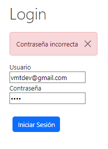

# Trabajogrupal

This project was generated with [Angular CLI](https://github.com/angular/angular-cli) version 17.3.8.

## Development server

Run `ng serve` for a dev server. Navigate to `http://localhost:4200/`. The application will automatically reload if you change any of the source files.
## Grupo de trabajo Bootcamp VmtDev
## Integrantes
- Shelton Carvallo
- Joshua Sarez

## Login
Pantalla de ingreso:
 

 
Validacion de Login con Bootstrap y navegador

 

 

## Lista de personas
Pantalla de lista de personas:

 

## Agregar Personas
Modal para Aagregar personas:

 
Validacion al agregar:

 
Se Agrega la persona y tambien se valida al momento si no ingresa el telefono o celular:

 